<h1 align="center">Hello, World! 🌍, I'm Sharwa 🙋‍♀️</h1>

<h3 align="center">
  BE IT Grad | Somewhere around data | Sometimes in the cloud | AI when an idea won't leave me alone 
  </h3>

  

  &nbsp;&nbsp;

  

  &nbsp;&nbsp;

  

  &nbsp;&nbsp;

  

- 🎓 BE Information Technology graduate passionate about building **data-driven solutions**
- 🐍 Working with **Python, SQL, Cloud, and AI/ML**  - because apparently one field wasn't enough
- ☁️ Currently exploring **Data Engineering, Microsoft Fabric, Azure, and Generative AI**
- 💼 **Open to Work** — connect with me at **sharwahodgar2030@gmail.com**

 

---
## 📊 My GitHub Stats

  

  

---

## 🛠️ Skills & Tools

### 🐍 Programming & Data

  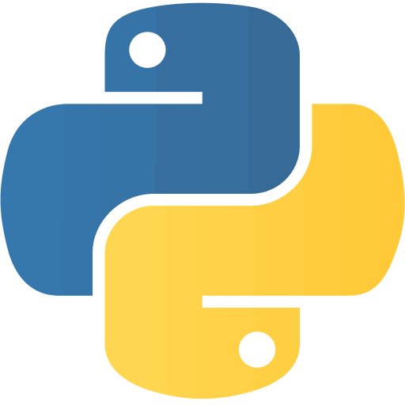
  
  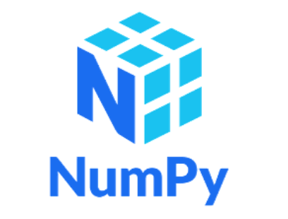
  
  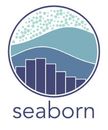
  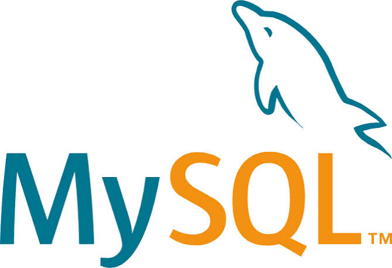
  

### ☁️ Data Engineering & Cloud

<h3 align="center">☁️ Data Engineering & Cloud</h3>

  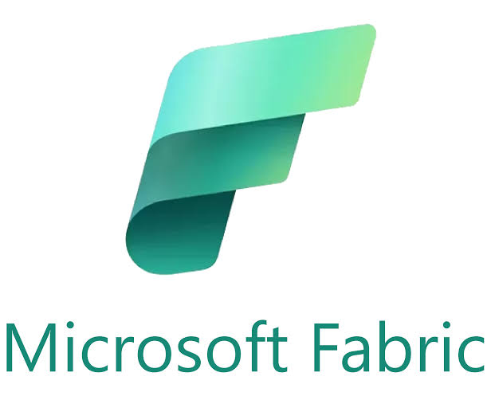
  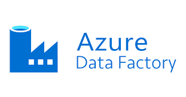
  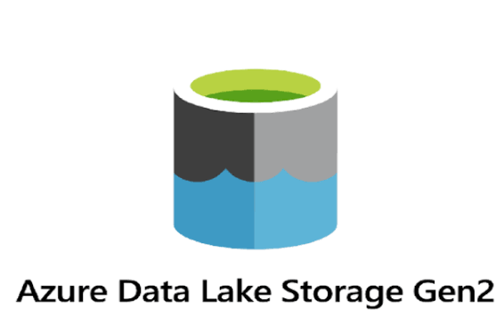
  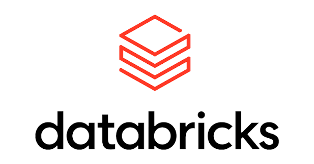
  
  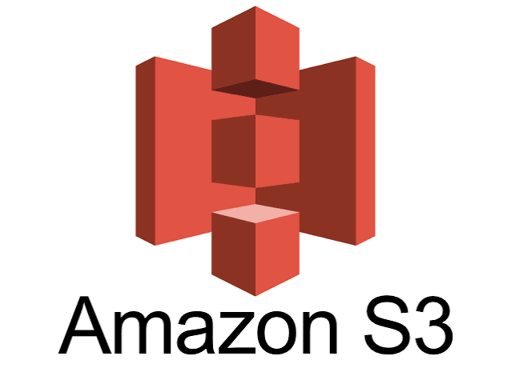
  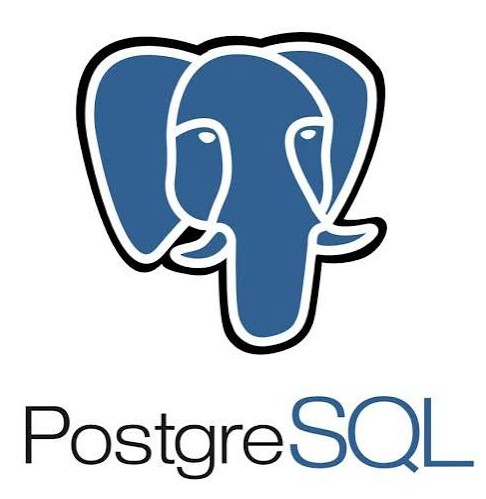

### 🤖 AI / ML & Development

<h3 align="center">🤖 AI / ML & Development</h3>

  
  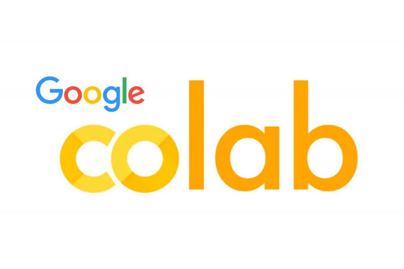
  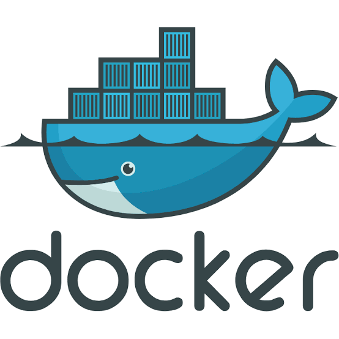
  
  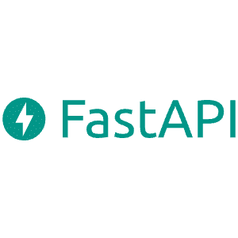
  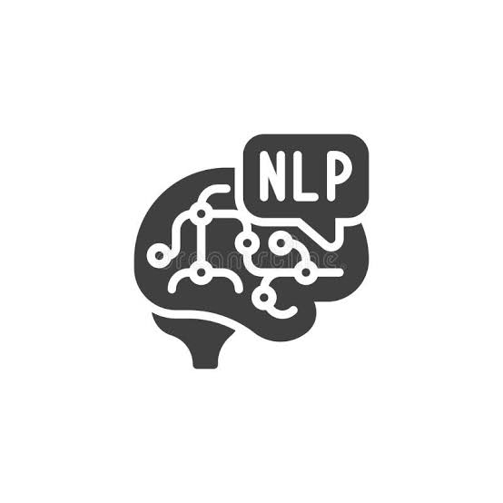
  

